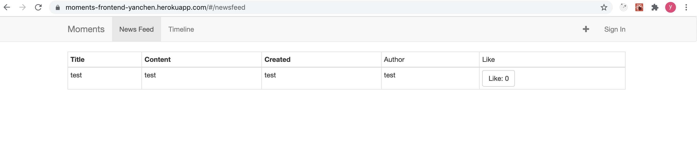

# Heroku
- Frontend: https://moments-frontend-yanchen.herokuapp.com/
- Backend: https://moments-backend-yanchen.herokuapp.com/

# Github
- Frontend: https://github.com/zhawayc/Moments_UI
- Backend: https://github.com/zhawayc/Moments_API

# Iteration 2
In the last iteration, I finished the frontend and backend implementation separately. In this iteration, I worked on solving the cross-origin problem, completed the itegration of backend with the frontend, and enabled the frontend to call the backend APIs to query and mutate the data. The integrated APIs and features include:
- Newsfeed Page
    - Displayed the newsfeed for the user
    - Enabled the user to like the post by clicking on the Like button
- Timeline Page
    - Displayed the timeline for the user if the user has created any stories before
    - Showed a message to remind the user to login if the user hasn't done so to see the timeline
    - Added feature for updating the story
    - Added feature for deleting the story
- NavBar
    - Added feature for user to sign in
    - Added feature for user to sign up
    - Added feature for user to create a new story, this button is disabled if the user hasn't signed in

# Iteration 1
- Frontend:
    - Finished UI design for components, including NavBar, AddStoryNavItem, SigninNavItem, NewsFeed, Timeline, CreateStory, UpdateStory, DeleteStory
    - Set up React Router to navigate across the components
- Backend:
    - Finished schema design, set up database in MongoDB Atlas
    - Set up backend server with Node.js / Express
    - Built GraphQL APIs to interact with the databse, including getStories, getStoriesByUserId, createStory, updateStory, deleteStory, likeStory
    - Developed APIs for user sign in / sign up

