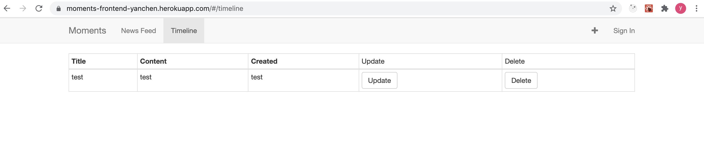

# Heroku
- Frontend: https://moments-frontend-yanchen.herokuapp.com/
- Backend: https://moments-backend-yanchen.herokuapp.com/

# Github
- Frontend: https://github.com/zhawayc/Moments_UI
- Backend: https://github.com/zhawayc/Moments_API

# Iteration 1
- Frontend:
    - Finished UI design for components, including NavBar, AddStoryNavItem, SigninNavItem, Timeline, CreateStory, UpdateStory, DeleteStory
    - Set up React Router to navigate across the components
- Backend:
    - Finished schema design, set up database in MongoDB Atlas
    - Set up backend server with Node.js / Express
    - Built GraphQL APIs to interact with the databse, including getStories, getStoriesByUserId, createStory, updateStory, deleteStory, likeStory
    - Developed APIs for user sign in / sign up

